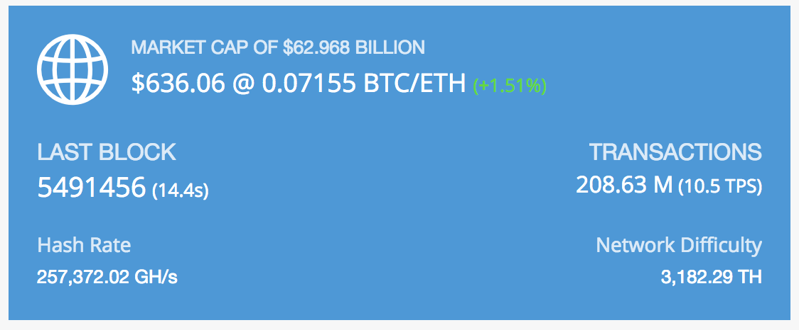
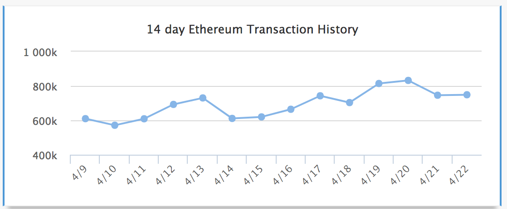
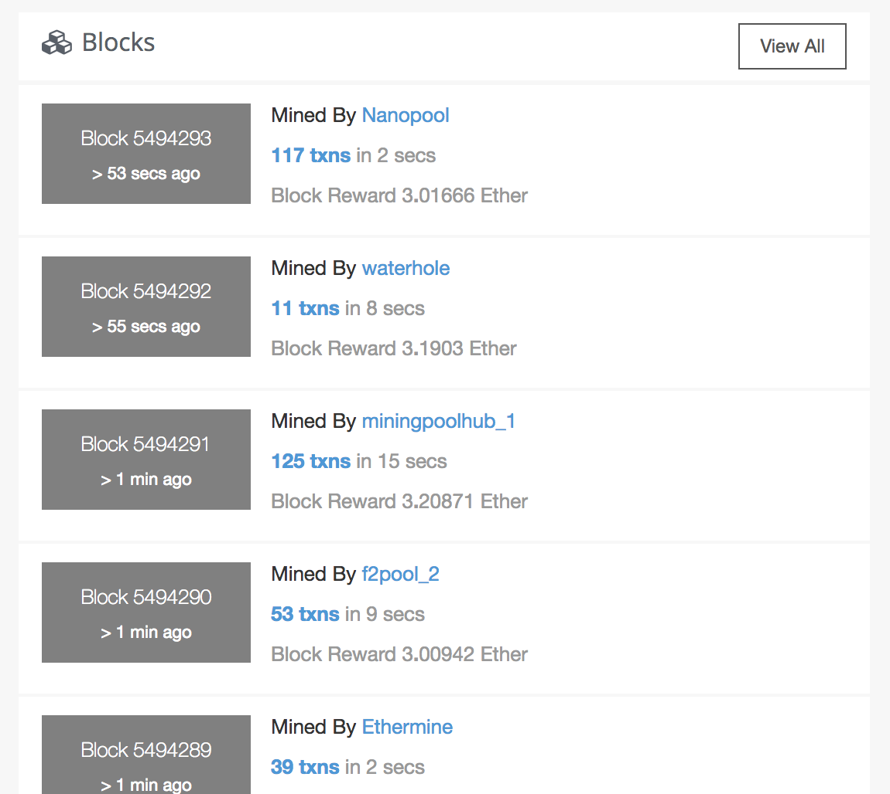
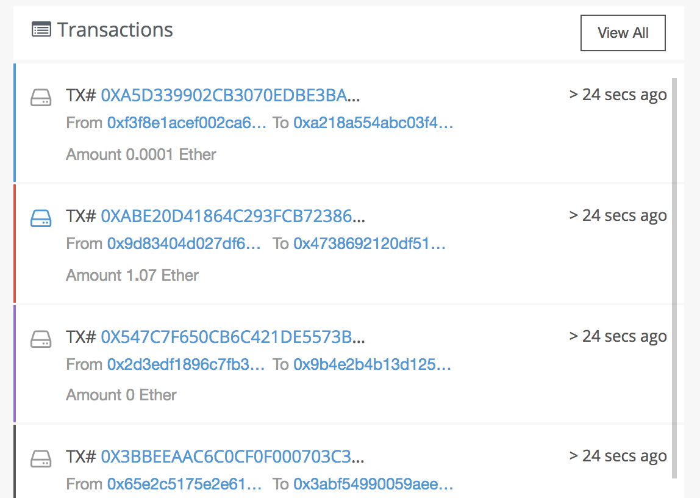

  1. 区块链总体情况

      - market cap
      - 当前价格和涨跌
      - 最新区块
      - Volume (24h)
      - Circulating Supply
      - Total Supply
      <!-- - 交易总量 -->
      - 

    API:
    https://coinmarketcap.com/api/
    https://coinmarketcap.com/currencies/tron/
      
  2. 交易数量走势，不做，等待后端api

  2. 代表信息，等待设计出图（考虑使用饼图）  
  放在交易数量走势位置

  3. 最新区块

    API: tronClient, 参考 wallet-web
    
  
  4. 最新交易

    API: tronClient, 参考 wallet-web